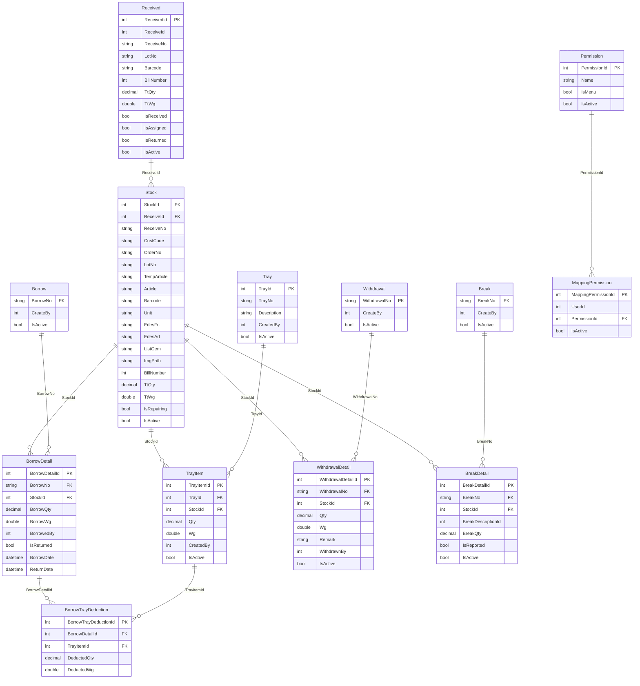

# คู่มือการใช้งานระบบ JP Stock Showroom

## ภาพรวมระบบ

**JP Stock Showroom** คือระบบบริหารจัดการสต็อกสินค้าอัญมณีและเครื่องประดับ ที่ออกแบบมาเพื่อติดตามวงจรชีวิตของสินค้าตั้งแต่การรับเข้า จัดเก็บ การยืม การเบิกถอน และการส่งซ่อม พัฒนาด้วย ASP.NET Core และรองรับการทำงานแบบหลายฐานข้อมูล

---

## สารบัญ

1. [การเข้าสู่ระบบ](#1-การเข้าสู่ระบบ)
2. [หน้าหลักและเมนู](#2-หน้าหลักและเมนู)
3. [ใบรับสินค้า (Receive Management)](#3-ใบรับสินค้า-receive-management)
4. [จัดการ Stock (Stock Management)](#4-จัดการ-stock-stock-management)
   - 4.1 [การดูรายการสต็อก](#41-การดูรายการสต็อก)
   - 4.2 [การจัดการถาด (Tray)](#42-การจัดการถาด-tray)
   - 4.3 [การยืมสินค้า (Borrow)](#43-การยืมสินค้า-borrow)
   - 4.4 [การเบิกถอนสินค้า (Withdraw)](#44-การเบิกถอนสินค้า-withdraw)
   - 4.5 [การแจ้งสินค้าชำรุด (Break/Repair)](#45-การแจ้งสินค้าชำรุด-breakrepair)
   - 4.6 [การเพิ่มสต็อกด้วยตนเอง](#46-การเพิ่มสต็อกด้วยตนเอง)
   - 4.7 [การนำเข้าข้อมูลจาก Excel](#47-การนำเข้าข้อมูลจาก-excel)
5. [พิมพ์รายงาน (Print Report)](#5-พิมพ์รายงาน-print-report)
   - 5.1 [รายงานการเบิกถอน (Withdrawal Report)](#51-รายงานการเบิกถอน-withdrawal-report)
   - 5.2 [รายงานการยืม (Borrow Report)](#52-รายงานการยืม-borrow-report)
   - 5.3 [รายงานสต็อก (Stock Report)](#53-รายงานสต็อก-stock-report)
   - 5.4 [รายงานสินค้าชำรุด (Break Report)](#54-รายงานสินค้าชำรุด-break-report)
6. [จัดการสิทธิ์การเข้าถึง (Permission Management)](#6-จัดการสิทธิ์การเข้าถึง-permission-management)
7. [คำอธิบายสถานะสินค้า](#7-คำอธิบายสถานะสินค้า)
8. [การแก้ไขปัญหาเบื้องต้น](#8-การแก้ไขปัญหาเบื้องต้น)

---

## 1. การเข้าสู่ระบบ

1. เปิดเบราว์เซอร์และไปที่ URL ของระบบ
2. กรอกชื่อผู้ใช้และรหัสผ่าน
3. กดปุ่ม **Sign In**
4. เมนูที่แสดงจะขึ้นอยู่กับสิทธิ์ที่ได้รับ

> **หมายเหตุ:** หากต้องการออกจากระบบ ให้กดที่เมนู **Sign Out** ทางด้านซ้ายมือ

---

## 2. หน้าหลักและเมนู

หน้าหลักประกอบด้วย **แถบเมนูด้านซ้าย** และ **พื้นที่เนื้อหาหลัก**

| เมนู | คำอธิบาย | สิทธิ์ที่ต้องการ |
|------|-----------|-----------------|
| ใบรับสินค้า | รับสินค้าเข้าระบบจากซัพพลายเออร์ | ReceiveManagement |
| จัดการ Stock | จัดการสต็อกสินค้าทั้งหมด | StockManagement |
| พิมพ์รายงาน | สร้างและพิมพ์รายงาน PDF | PrintReport |
| จัดการสิทธิ์การเข้าถึง | จัดการสิทธิ์ผู้ใช้งาน | PermissionManagement |

---

## 3. ใบรับสินค้า (Receive Management)

### วัตถุประสงค์
บันทึกการรับสินค้าเข้าจากซัพพลายเออร์หรือแหล่งผลิต เพื่อเพิ่มสินค้าเข้าสู่ระบบสต็อก

### ขั้นตอนการใช้งาน
1. คลิกเมนู **ใบรับสินค้า** ทางด้านซ้าย
2. กรอกข้อมูลที่ต้องการ ได้แก่:
   - รหัสสินค้า (Article)
   - บาร์โค้ด
   - จำนวน
   - น้ำหนัก
3. กดปุ่ม **บันทึก** เพื่อเพิ่มสินค้าเข้าระบบ

---

## 4. จัดการ Stock (Stock Management)

### วัตถุประสงค์
เมนูหลักสำหรับดูและจัดการสินค้าในคลัง ประกอบด้วยฟังก์ชันย่อยหลายอย่าง

---

### 4.1 การดูรายการสต็อก

#### การกรองและค้นหา
ที่ **แถบกรองข้อมูล** ด้านบน สามารถกรองได้ด้วย:

| ตัวกรอง | คำอธิบาย |
|---------|-----------|
| Article | รหัสหรือชื่อสินค้า |
| EDesArt | รหัสการออกแบบ |
| สถานะการลงทะเบียน | Pending Z (รอดำเนินการ) / Registered (ลงทะเบียนแล้ว) |

กดปุ่ม **ค้นหา** เพื่อโหลดรายการ

#### คอลัมน์ในตารางสต็อก

| คอลัมน์ | คำอธิบาย |
|---------|-----------|
| รูปภาพ | ภาพตัวอย่างสินค้า |
| Article / Temp Article | รหัสสินค้าหลักหรือชั่วคราว |
| Order No | หมายเลขคำสั่งผลิต |
| FN Description | รายละเอียดโลหะ |
| GEM Description | รายละเอียดอัญมณี |
| จำนวนทั้งหมด | ยอดรวมในระบบ |
| จำนวนคงเหลือ | ยอดที่ยังไม่ได้จัดสรร |
| จำนวนในถาด | ยอดที่อยู่ในถาดแล้ว |
| สถานะ | ในถาด / เบิกถอน / ซ่อม |

---

### 4.2 การจัดการถาด (Tray)

ถาด (Tray) คือภาชนะจัดเก็บสินค้าจริงในคลัง ใช้แบ่งกลุ่มสินค้าเพื่อความสะดวกในการหยิบใช้

#### การสร้างถาดใหม่
1. คลิกแท็บ **ถาด (Tray)**
2. กดปุ่ม **สร้างถาดใหม่**
3. กรอกชื่อ/คำอธิบายถาด
4. กดปุ่ม **ยืนยัน**

#### การเพิ่มสินค้าเข้าถาด
1. ในตารางสต็อก เลือกสินค้าที่ต้องการ
2. กดปุ่ม **เพิ่มเข้าถาด** (ไอคอน + ถาด)
3. เลือกถาดปลายทาง
4. ระบุจำนวนที่ต้องการเพิ่ม
5. กดปุ่ม **ยืนยัน**

#### การนำสินค้าออกจากถาด
1. เปิดรายการถาดที่ต้องการ
2. กดปุ่ม **นำออก** ที่รายการสินค้า
3. ระบุจำนวน
4. กดปุ่ม **ยืนยัน**

#### การลบถาด
1. กดปุ่ม **ลบถาด** ที่ถาดที่ต้องการ
2. ระบบจะแจ้งเตือนก่อนลบ
3. กดยืนยันเพื่อลบ

> **คำเตือน:** ควรนำสินค้าออกจากถาดก่อนลบถาด

---

### 4.3 การยืมสินค้า (Borrow)

ใช้สำหรับการนำสินค้าออกไปใช้ชั่วคราว โดยสินค้ายังคงอยู่ในระบบแต่ถูกระบุว่า "ถูกยืม"

#### การยืมสินค้า
1. ในตารางสต็อก กดปุ่ม **ยืม** ที่รายการสินค้า
2. กรอกข้อมูล:
   - รหัสผู้ยืม
   - จำนวนที่ยืม
   - วันที่ยืม
3. กดปุ่ม **ยืนยัน**

#### การคืนสินค้า
1. คลิกแท็บ **การยืม**
2. ค้นหารายการที่ต้องการคืน
3. กดปุ่ม **คืน** ที่รายการนั้น
4. ตรวจสอบจำนวน แล้วกด **ยืนยัน**

> **หมายเหตุ:** ไม่สามารถคืนสินค้าเกินจำนวนที่ยืมได้

---

### 4.4 การเบิกถอนสินค้า (Withdraw)

ใช้สำหรับการนำสินค้าออกจากระบบอย่างถาวร เช่น ส่งลูกค้า หรือ นำออกจำหน่าย

#### ขั้นตอนการเบิกถอน
1. ในตารางสต็อก กดปุ่ม **เบิกถอน** ที่รายการสินค้า
2. กรอกข้อมูล:
   - จำนวนที่เบิกถอน
   - หมายเหตุ (เหตุผลการเบิกถอน)
3. กดปุ่ม **ยืนยัน**

#### การดูประวัติการเบิกถอน
1. คลิกแท็บ **การเบิกถอน**
2. รายการทั้งหมดจะแสดงพร้อมวันที่และผู้ดำเนินการ

> **คำเตือน:** การเบิกถอนเป็นการลบสินค้าออกจากระบบอย่างถาวร ไม่สามารถยกเลิกได้ง่าย

---

### 4.5 การแจ้งสินค้าชำรุด (Break/Repair)

ใช้บันทึกสินค้าที่ชำรุดเสียหาย เพื่อส่งซ่อมหรือตัดออกจากสต็อก

#### การแจ้งสินค้าชำรุด
1. ในตารางสต็อก กดปุ่ม **แจ้งชำรุด** ที่รายการสินค้า
2. กรอกข้อมูล:
   - ประเภทความเสียหาย (เลือกจากรายการ)
   - รายละเอียดเพิ่มเติม
   - จำนวนที่ชำรุด
3. กดปุ่ม **ยืนยัน**

#### การสร้างเอกสารส่งซ่อม
1. คลิกแท็บ **สินค้าชำรุด**
2. เลือกรายการที่ต้องการสร้างเอกสาร
3. กดปุ่ม **สร้างเอกสาร**
4. ระบบจะสร้างเลขที่เอกสารอัตโนมัติ

---

### 4.6 การเพิ่มสต็อกด้วยตนเอง

ใช้สำหรับเพิ่มสินค้าเข้าระบบโดยไม่ผ่านใบรับสินค้า

#### ขั้นตอน
1. คลิกแท็บ **เพิ่มสต็อก**
2. ค้นหาสินค้าด้วยบาร์โค้ดหรือรหัสสินค้า
3. ตรวจสอบข้อมูลสินค้าที่แสดง
4. ระบุจำนวนที่ต้องการเพิ่ม
5. กดปุ่ม **เพิ่ม**

---

### 4.7 การนำเข้าข้อมูลจาก Excel

ใช้สำหรับการเพิ่มสินค้าจำนวนมากในครั้งเดียวผ่านไฟล์ Excel

#### รูปแบบไฟล์ Excel ที่รองรับ

ไฟล์ต้องประกอบด้วยคอลัมน์:
- **Article** - รหัสสินค้า (บังคับ)
- **Barcode** - บาร์โค้ด (บังคับ)
- **Quantity** - จำนวน (บังคับ)
- **Weight** - น้ำหนัก (ถ้ามี)

#### ขั้นตอนการนำเข้า
1. คลิกแท็บ **นำเข้า Excel**
2. กดปุ่ม **เลือกไฟล์** และเลือกไฟล์ Excel
3. กดปุ่ม **นำเข้า**
4. ระบบจะแสดงผลการนำเข้าแต่ละแถว:
   - ✅ สำเร็จ
   - ❌ ล้มเหลว พร้อมสาเหตุ

> **หมายเหตุ:** หากมีข้อผิดพลาดร้ายแรง ระบบจะยกเลิกการนำเข้าทั้งหมด (Rollback)

---

## 5. พิมพ์รายงาน (Print Report)

### วัตถุประสงค์
สร้างและดาวน์โหลดรายงาน PDF สำหรับการจัดการสต็อกประเภทต่างๆ

---

### 5.1 รายงานการเบิกถอน (Withdrawal Report)

#### ตัวกรองที่ใช้ได้
| ตัวกรอง | คำอธิบาย |
|---------|-----------|
| Article | รหัสหรือชื่อสินค้า |
| เลขที่เบิกถอน | หมายเลขเอกสารการเบิกถอน |
| EDesArt | รหัสการออกแบบ |

#### ขั้นตอน
1. คลิกแท็บ **รายงานการเบิกถอน**
2. กรอกตัวกรองที่ต้องการ
3. กดปุ่ม **ดูรายงาน** เพื่อพรีวิว
4. กดปุ่ม **พิมพ์/ดาวน์โหลด PDF** เพื่อบันทึก

---

### 5.2 รายงานการยืม (Borrow Report)

#### ตัวกรองที่ใช้ได้
| ตัวกรอง | คำอธิบาย |
|---------|-----------|
| Article | รหัสหรือชื่อสินค้า |
| เลขที่ยืม | หมายเลขเอกสารการยืม |
| EDesArt | รหัสการออกแบบ |
| สถานะการคืน | คืนแล้ว / ยังไม่คืน |

#### ขั้นตอน
1. คลิกแท็บ **รายงานการยืม**
2. กรอกตัวกรองที่ต้องการ
3. กดปุ่ม **ดูรายงาน** หรือ **สร้างเอกสาร**

---

### 5.3 รายงานสต็อก (Stock Report)

มี 2 รูปแบบ:

#### รูปแบบที่ 1: พร้อมรูปภาพ
- แสดงในรูปแบบการ์ด 5 คอลัมน์
- แต่ละการ์ดมีรูปสินค้า ลำดับ รหัส จำนวน และถาด
- เหมาะสำหรับการตรวจสอบสินค้าจริง

#### รูปแบบที่ 2: ไม่มีรูปภาพ
- แสดงในรูปแบบตาราง
- เหมาะสำหรับการพิมพ์รายงานสรุป

#### ตัวกรองที่ใช้ได้
| ตัวกรอง | คำอธิบาย |
|---------|-----------|
| Article | รหัสหรือชื่อสินค้า |
| EDesArt | รหัสการออกแบบ |
| สถานะการลงทะเบียน | Pending Z / Registered |

---

### 5.4 รายงานสินค้าชำรุด (Break Report)

#### ตัวกรองที่ใช้ได้
| ตัวกรอง | คำอธิบาย |
|---------|-----------|
| Article | รหัสหรือชื่อสินค้า |
| เลขที่เอกสาร | หมายเลขเอกสารการแจ้งชำรุด |
| ประเภทความเสียหาย | ประเภทของความชำรุด |

#### ขั้นตอน
1. คลิกแท็บ **รายงานสินค้าชำรุด**
2. กรอกตัวกรองที่ต้องการ
3. กดปุ่ม **ดูรายงาน** หรือ **สร้างเอกสาร**

---

## 6. จัดการสิทธิ์การเข้าถึง (Permission Management)

> **เฉพาะผู้ดูแลระบบ (Admin)**

### วัตถุประสงค์
กำหนดสิทธิ์การเข้าถึงเมนูต่างๆ ให้กับผู้ใช้งานแต่ละคน

### สิทธิ์ที่กำหนดได้

| สิทธิ์ | เมนูที่เข้าถึงได้ |
|--------|-----------------|
| ReceiveManagement | ใบรับสินค้า |
| StockManagement | จัดการ Stock |
| PrintReport | พิมพ์รายงาน |
| PermissionManagement | จัดการสิทธิ์ (Admin เท่านั้น) |

### ขั้นตอน
1. คลิกเมนู **จัดการสิทธิ์การเข้าถึง**
2. ค้นหาผู้ใช้ที่ต้องการจัดการ
3. ติ๊กหรือยกเลิกสิทธิ์ที่ต้องการ
4. กดปุ่ม **บันทึก**

---

## 7. คำอธิบายสถานะสินค้า

| สถานะ | ความหมาย |
|-------|----------|
| Available (คงเหลือ) | สินค้าพร้อมใช้งาน ยังไม่ได้จัดสรร |
| In Tray (ในถาด) | สินค้าถูกนำเข้าถาดเรียบร้อยแล้ว |
| Borrowed (ถูกยืม) | สินค้าถูกยืมออกไปชั่วคราว |
| Withdrawn (เบิกถอน) | สินค้าถูกนำออกจากระบบอย่างถาวร |
| Repairing (ซ่อม) | สินค้าชำรุดและอยู่ระหว่างการซ่อม |
| Pending Z | สินค้าที่ยังรอการลงทะเบียน |
| Registered | สินค้าที่ลงทะเบียนในระบบแล้ว |

---

## 8. การแก้ไขปัญหาเบื้องต้น

### รูปภาพสินค้าไม่แสดง
- ระบบดึงรูปจาก Network Share `\\factoryserver\bmp$`
- ตรวจสอบว่าเครื่องสามารถเชื่อมต่อกับ Server ได้
- หากไม่มีรูป ระบบจะแสดงรูป placeholder แทน

### ไฟล์ Excel นำเข้าไม่สำเร็จ
- ตรวจสอบรูปแบบไฟล์ว่าถูกต้อง (รองรับ .xlsx)
- ตรวจสอบว่าคอลัมน์ Article, Barcode, Quantity มีครบ
- ดูรายละเอียดข้อผิดพลาดในผลลัพธ์การนำเข้า

### ไม่พบเมนูบางรายการ
- สิทธิ์ของผู้ใช้อาจไม่ครอบคลุมเมนูนั้น
- ติดต่อผู้ดูแลระบบเพื่อขอสิทธิ์เพิ่มเติม

### รายงาน PDF ไม่สร้าง
- ตรวจสอบว่ามีข้อมูลตรงกับตัวกรองที่เลือก
- ลองลดเงื่อนไขการกรองและลองใหม่

---

## ข้อมูลระบบ

| รายการ | รายละเอียด |
|--------|-----------|
| Framework | ASP.NET Core 9.0 |
| ภาษาหลัก | ภาษาไทย |
| รูปแบบวันที่ | ปฏิทินพุทธศักราช (พ.ศ.) |
| รูปแบบรายงาน | PDF (A4 แนวตั้ง) |
| การนำเข้าข้อมูล | Excel (.xlsx) |

---

## 9. ER Diagram — JPStockShowroom (SW Database)

### อธิบายความสัมพันธ์หลัก

| ความสัมพันธ์ | คำอธิบาย |
|-------------|----------|
| `Received` → `Stock` | สินค้าที่รับเข้า (Received) จะกลายเป็น Stock ในระบบ |
| `Stock` → `TrayItem` | สินค้าหนึ่งชิ้นสามารถอยู่ในหลายถาดได้ |
| `Tray` → `TrayItem` | ถาดหนึ่งใบมีรายการสินค้าหลายรายการ |
| `Borrow` → `BorrowDetail` | เอกสารยืมหนึ่งใบมีรายละเอียดสินค้าหลายรายการ |
| `BorrowDetail` → `BorrowTrayDeduction` | การยืมจะตัดจำนวนออกจากถาดที่เกี่ยวข้อง |
| `TrayItem` → `BorrowTrayDeduction` | ระบุว่าตัดจาก TrayItem ใด |
| `Withdrawal` → `WithdrawalDetail` | เอกสารเบิกถอนหนึ่งใบมีรายการสินค้าหลายรายการ |
| `Break` → `BreakDetail` | เอกสารแจ้งชำรุดหนึ่งใบมีรายการสินค้าหลายรายการ |
| `Permission` → `MappingPermission` | สิทธิ์ถูก mapping กับ User |

---

*คู่มือนี้ครอบคลุมการใช้งานหลักของระบบ JP Stock Showroom สำหรับข้อมูลเพิ่มเติมหรือปัญหาที่ไม่ได้ระบุในคู่มือ กรุณาติดต่อผู้ดูแลระบบ*
